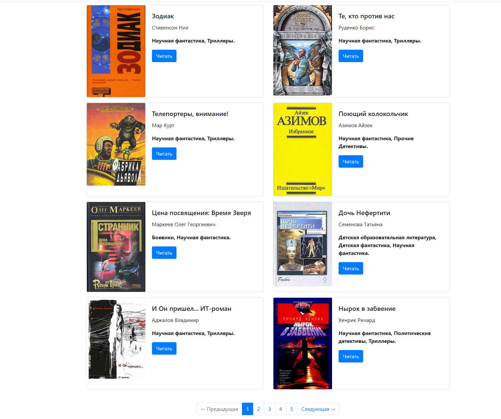

# Онлайн-библиотека

Сайт-библиотека на Python + Jinja2.

## Запуск

Установите зависимости:

- `pip install -r requirements.txt`

Режим разработки (LiveReload):

- `python render_website.py --serve`
- или с другим JSON: `python render_website.py --json data/books.json --serve`

Сайт откроется на http://127.0.0.1:5500

Изменения в template.html и meta_data.json пересобирают сайт автоматически.

Проект полностью работает без интернета (Bootstrap/JS подключены локально).

Двойной клик по docs/index.html (редирект откроет docs/pages/index1.html).

Либо открыть прямо docs/pages/index1.html.

[Сайт](https://azad0645.github.io/online-books/)
